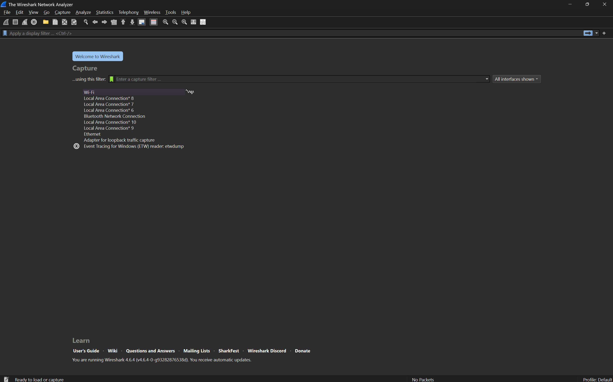

# Instalasi Wireshark
Laporan pekan 1 ini mendokumentasikan langkah-langkah persiapan dan instalasi perangkat lunak Wireshark untuk keperluan analisis lalu lintas jaringan.

## Prerequisites (Prasyarat Instalasi)
Sebelum memulai proses instalasi, pastikan poin-poin berikut telah terpenuhi untuk menjamin fungsionalitas aplikasi:

- **Hak Akses Administrator/Root:** Proses instalasi dan pengambilan paket data (packet capturing) memerlukan hak akses tinggi pada sistem operasi.

- **Driver Capture (Sangat Penting):**

- **Windows:** Memerlukan driver Npcap. Tanpa ini, Wireshark hanya bisa membuka file simpanan dan tidak bisa menangkap data dari kartu jaringan secara langsung.

- **Koneksi Internet:** Diperlukan untuk mengunduh paket installer atau dependensi tambahan saat proses instalasi berlangsung.

- **Keamanan Sistem:** Pastikan pengaturan Firewall atau Antivirus anda  tidak memblokir driver packet sniffing saat proses instalasi dilakukan.

- **Note :** Saya menggunakan windows, jadi langkah-langkah akan dilakukan menurut urutan download windows.

 

## Langkah-Langkah Instalasi
### A. Windows 
**1.** Unduh installer resmi dari situs wireshark.org.

**2.** Jalankan file `.exe` dengan opsi Run as Administrator.

**3.** Pilih komponen yang akan diinstal. Pastikan Wireshark dan TShark (versi CLI) terpilih.

**4.** Instalasi Npcap: Saat installer menanyakan tentang Npcap, centang opsi instalasi. Jika sudah ada versi lama, disarankan untuk melakukan update.

### Selesaikan proses dan lakukan restart perangkat jika diminta agar driver jaringan dapat dimuat dengan sempurna.

** hasil nya akan seperti ini :**   

