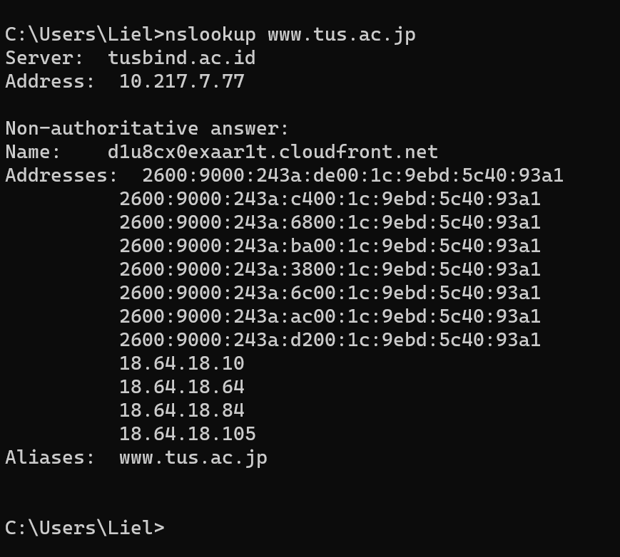
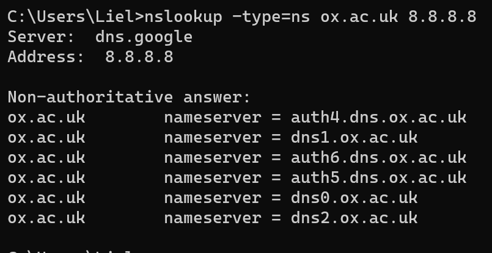
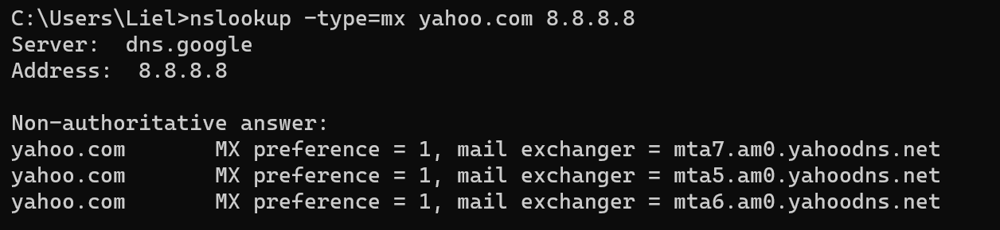
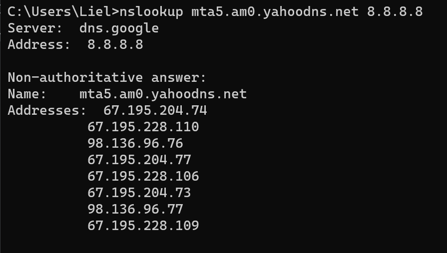

## Pertanyaan
1. Jalankan nslookup untuk mendapatkan alamat IP dari server web di Asia. Berapa alamat IP
server tersebut?
2. Jalankan nslookup agar dapat mengetahui server DNS otoritatif untuk universitas di Eropa.
3. Jalankan nslookup untuk mencari tahu informasi mengenai server email dari Yahoo! Mail melalui salah satu server yang didapatkan di pertanyaan nomor 2. Apa alamat IP-nya?

## JAWABAN 
### soal 1

### soal 2

### soal 3

Berdasarkan hasil perintah `nslookup -type=mx yahoo.com 8.8.8.8`, ditemukan Yahoo memiliki beberapa Mail Exchanger. Untuk mengetahui alamat IP-nya, dilakukan lookup lanjutan pada salah satu server tersebut (mta5.am0.yahoodns.net).

