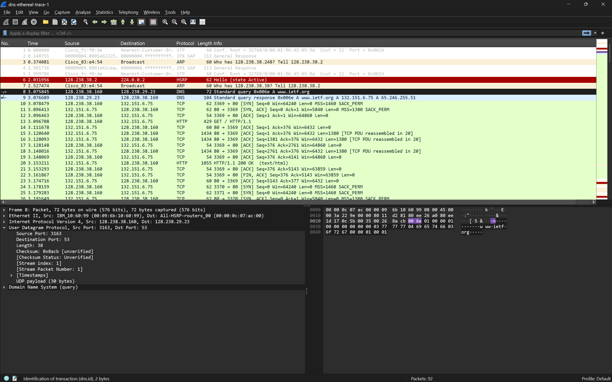
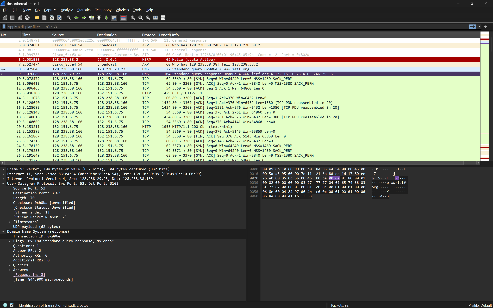
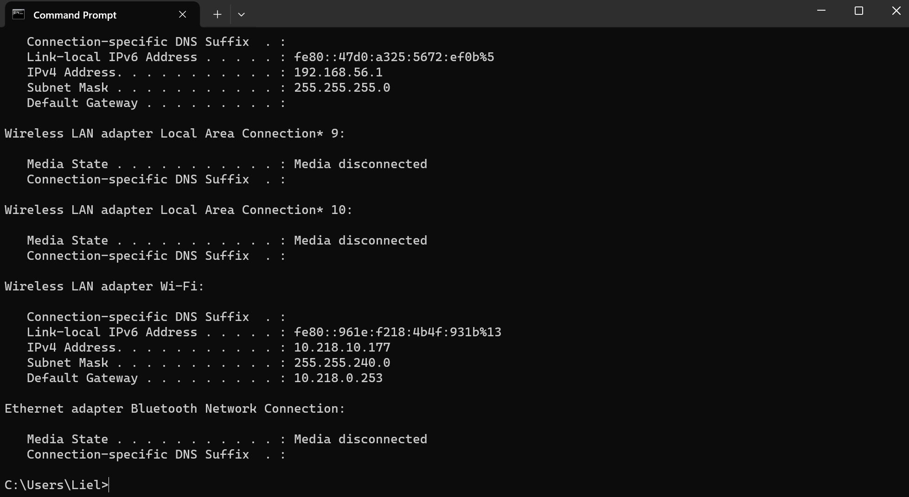
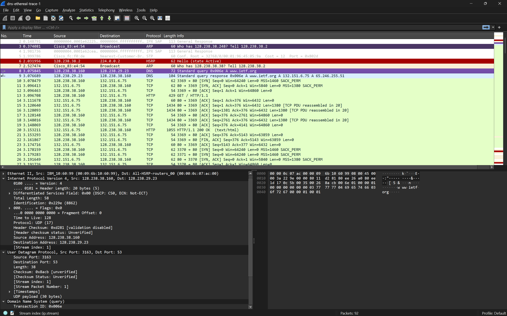
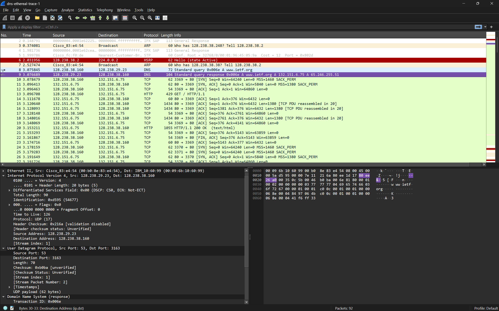

## Pertanyaan
1. Cari pesan permintaan DNS dan balasannya. Apakah pesan tersebut dikirimkan melalui UDP atau TCP?
2. Apa port tujuan pada pesan permintaan DNS? Apa port sumber pada pesan balasannya?
3. Pada pesan permintaan DNS, apa alamat IP tujuannya? Apa alamat IP server DNS lokal anda (gunakan ipconfig untuk mencari tahu)? Apakah kedua alamat IP tersebut sama?
4. Periksa pesan permintaan DNS. Apa “jenis” atau ”type” dari pesan tersebut? Apakah pesan permintaan tersebut mengandung ”jawaban” atau ”answers”?
5. Periksa pesan balasan DNS. Berapa banyak ”jawaban” atau ”answers” yang terdapat di dalamnya? Apa saja isi yang terkandung dalam setiap jawaban tersebut?
6. Perhatikan paket TCP SYN yang selanjutnya dikirimkan oleh host Anda. Apakah alamat IP pada paket tersebut sesuai dengan alamat IP yang tertera pada pesan balasan DNS?
7. Halaman web yang sebelumnya anda akses (http://www.ietf.org) memuat beberapa gambar. Apakah host Anda perlu mengirimkan pesan permintaan DNS baru setiap kali ingin mengakses suatu gambar?

## JAWABAN 
### menggunakan `dns-ethereal-trace-1`

### soal 1
 - Pesan DNS dikirim melalui UDP

### soal 2

- Port tujuan pada permintaan DNS adalah 53 Port sumber pada balasan DNS adalah 53

### soal 3

- port tujuan pada komputer saya berbeda namun pada wireshark sama diakibatkan saya menggunakan file `wireshark-traces` pada bagian `dns-ethereal-trace-1`

- kalian bisa lihat pada sources addres dan destinasion nya sama

### soal 4
Pada pesan permintaan untuk host www.ietf.org:
Type: A, biasa digunakan untuk domain ke alamat IPv4
Answers: Pesan tidak mengandung answer karena pesan hanya mengandung Queries.

### soal 5
Pada pesan respon, ada 2 Answer.
- www.ietf.org: type A, class IN, addr 132.151.6.75
- www.ietf.org: type A, class IN, addr 65.246.255.51

### soal 6
Setelah proses DNS selesai, host akan mengirimkan paket TCP SYN untuk menginisialisasi koneksi HTTP/HTTPS.

### soal 7
Host tidak perlu mengirimkan pesan permintaan DNS baru setiap kali ingin mengakses gambar pada halaman web yang sama, sebab disimpan dalam chache dns.

