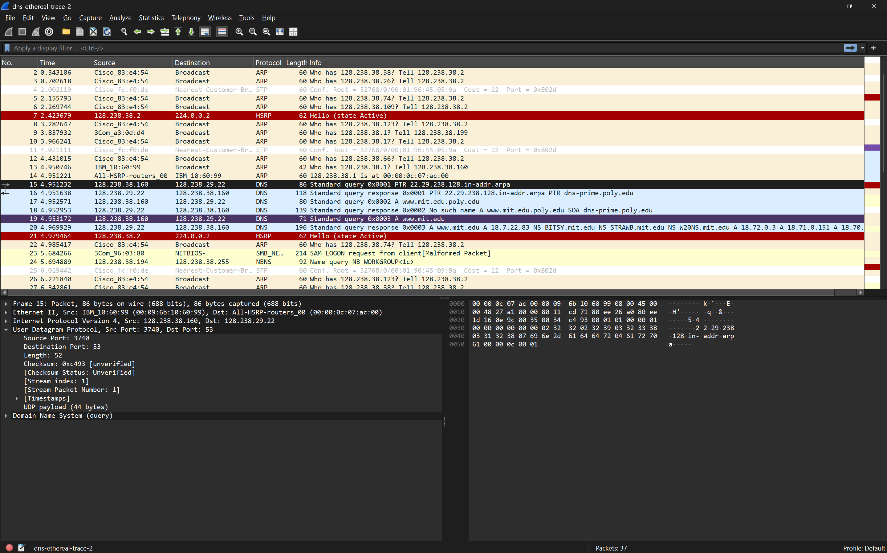
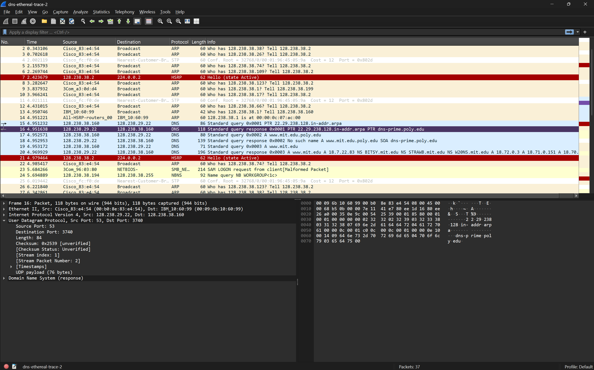
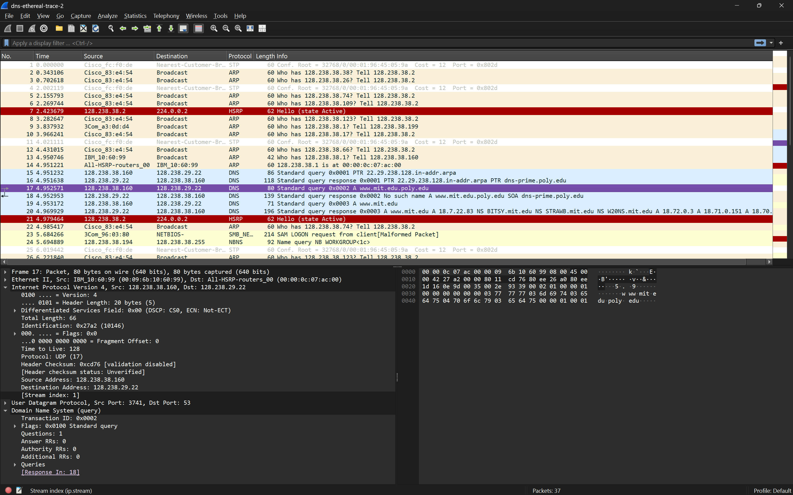
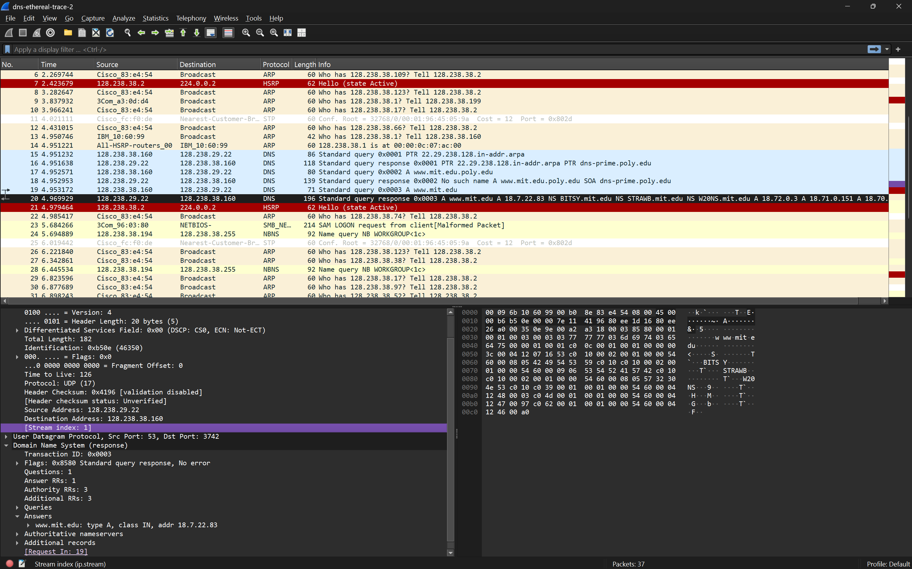

## Pertanyaan
1. Apa port tujuan pada pesan permintaan DNS? Apa port sumber pada pesan balasan DNS?
2. Ke alamat IP manakah pesan permintaan DNS dikirimkan? Apakah alamat IP tersebut merupakan default alamat IP server DNS lokal Anda?
3. Periksa pesan permintaan DNS. Apa ”jenis” atau ”type” dari pesan tersebut? Apakah pesan tersebut mengandung ”jawaban” atau ”answers”?
4. Periksa pesan balasan DNS. Berapa banyak ”jawaban” atau “answers” yang terdapat didalamnya. Apa saja isi yang terkandung dalam setiap jawaban tersebut?
5. Sertakan hasil tangkapan layar.

## JAWABAN 
### menggunakan `dns-ethereal-trace-2`

### soal 1
berdasarkan data dari di atas kita lihat pada query 15 dan 16
 -  port tujuan : 53
 -  port respond : 53 

### soal 2
- port nya adalah `128.238.29.22`
- jadi iya , kalo ini adalah port local.

### soal 3

Pada pesan permintaan untuk host www.mit.edu:
- Type: A, biasa digunakan untuk domain ke alamat IPv4
- disini hanya mengandung pertanyaan tidak ada jawaban

### soal 4

Pada pesan jawaban untuk host www.mit.edu terdapat 1 jawaban:
- www.mit.edu : type A : class IN, addr 18.7.22.83

