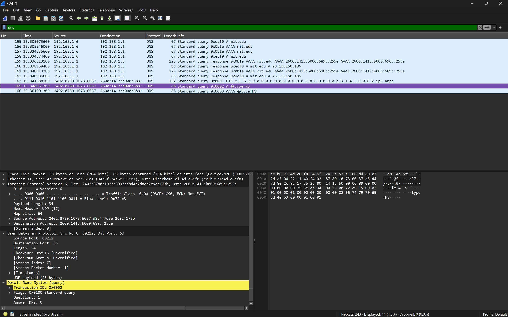
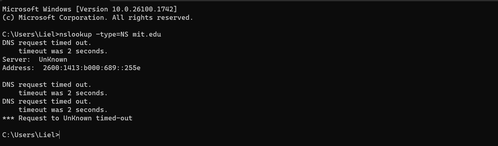
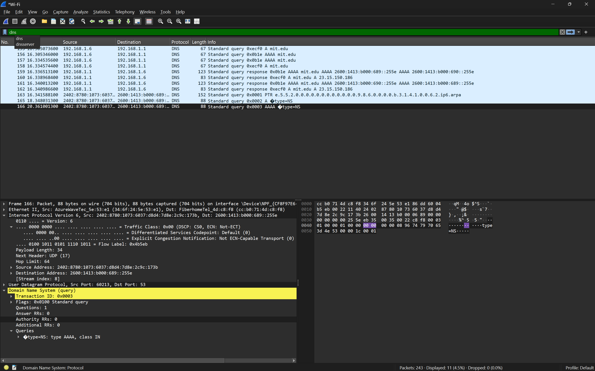

## Pertanyaan
1. Ke alamat IP manakah pesan permintaan DNS dikirimkan? Apakah alamat IP tersebut merupakan default alamat IP server DNS lokal Anda?
2. Periksa pesan permintaan DNS. Apa ”jenis” atau ”type” dari pesan tersebut? Apakah pesan tersebut mengandung ”jawaban” atau ”answers”?
3. Periksa pesan balasan DNS. Apa nama server MIT yang diberikan oleh pesan balasan? Apakah pesan balasan ini juga memberikan alamat IP untuk server MIT tersebut?

## JAWABAN 

### soal 1
- Pesan permintaan DNS dikirim ke alamat IP `2404:c0:b200::3:1` 
- alamat tersebut merupakan DNS lokal karena sama dengan hasil ipconfig di cmd saya.

### soal 2

Pada pesan questnya:
- Type:NS , type AAAA,class IN

### soal 3
Pesan balasan DNS memberikan nama server mit.edu. Pesan tersebut juga memberikan alamat IP untuk server tersebut, yaitu 23.15.150.186 (untuk tipe A/IPv4) sesuai yang terlihat pada paket nomor 160 dan 162 di Wireshark.
