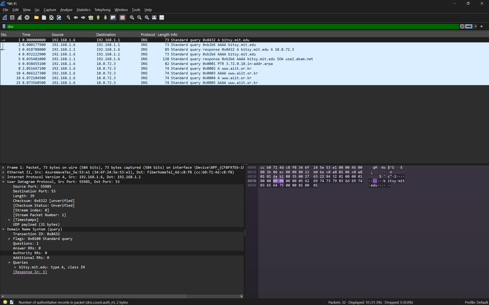
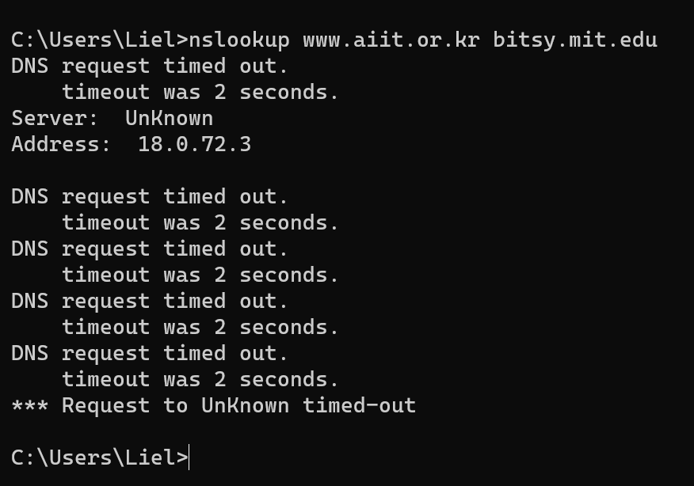
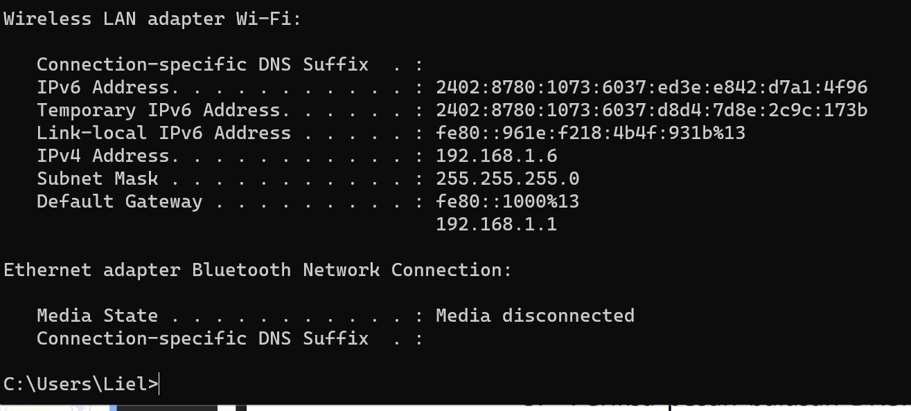

## Pertanyaan
1. Ke alamat IP manakah pesan permintaan DNS dikirimkan? Apakah alamat IP tersebut merupakan default alamat IP server DNS lokal Anda?
2. Periksa pesan permintaan DNS. Apa ”jenis” atau ”type” dari pesan tersebut? Apakah pesan tersebut mengandung ”jawaban” atau ”answers”?
3. Periksa pesan balasan DNS. Berapa banyak ”jawaban” atau “answers” yang terdapat di dalamnya. Apa saja isi yang terkandung dalam setiap jawaban tersebut?

## JAWABAN 

### soal 1
- Alamat IP Tujuan: Pesan permintaan DNS (Frame 1) dikirimkan ke alamat IP 192.168.1.1.

- Status DNS Lokal: Ya, alamat ini kemungkinan besar merupakan alamat IP default gateway atau router Anda yang berfungsi sebagai DNS Forwarder/Server lokal. Di jaringan rumah atau kantor kecil, router biasanya bertindak sebagai perantara DNS bagi perangkat di dalamnya.

### soal 2

- Jenis (Type): Pesan tersebut adalah tipe Standard query (Flag: 0x0100). Secara spesifik, ia menanyakan record tipe A (untuk mendapatkan alamat IPv4) dari host bitsy.mit.edu.
- Apakah mengandung "jawaban" (Answers): Tidak. Pesan permintaan hanya berisi bagian "Queries". Seperti yang terlihat pada detail paket: Answer RRs: 0. Jawaban hanya akan ditemukan pada paket balasan (response) dari server.

### soal 3
Melihat pada daftar paket, balasan untuk permintaan pertama (Transaction ID: 0x8432) berada pada Frame 3.
- Jumlah Jawaban: Terdapat 1 jawaban (Answer RRs: 1 sebagaimana terlihat pada kolom "Info" untuk Frame 3: Standard query response... A 18.0.72.3).
- si Jawaban: * Name: bitsy.mit.edu
- Type: A (Host Address)
- Address: 18.0.72.3
- Class: IN (Internet)
- TTL (Time to Live): (Nilai ini menentukan berapa lama jawaban disimpan di cache, biasanya terlihat jika detail Frame 3 dibuka penuh).
