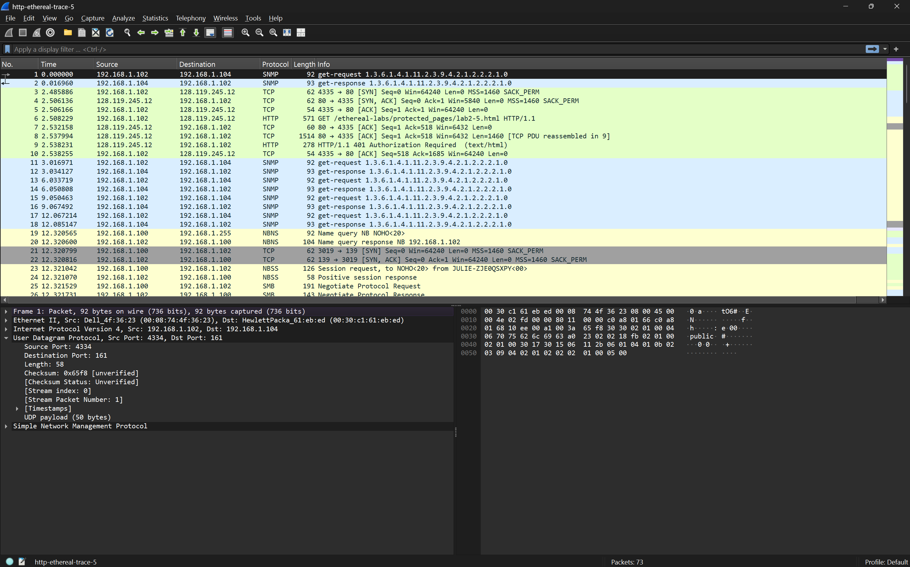
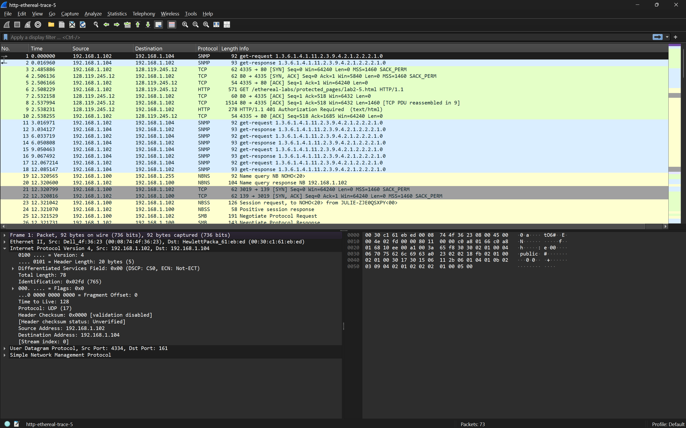

## Pertanyaan
1. Pilih satu paket UDP yang terdapat pada trace Anda. Dari paket tersebut, berapa banyak “field” yang terdapat pada header UDP? Sebutkan nama-nama field yang Anda temukan!
2. Perhatikan informasi “content field” pada paket yang Anda pilih di pertanyaan 1. Berapa panjang (dalam satuan byte) masing-masing “field” yang terdapat pada header UDP?
3. Nilai yang tertera pada ”Length” menyatakan nilai apa? Verfikasi jawaban Anda melalui paket UDP pada trace.
4. Berapa jumlah maksimum byte yang dapat disertakan dalam payload UDP? (Petunjuk: jawaban untuk pertanyaan ini dapat ditentukan dari jawaban Anda untuk pertanyaan 2)
5. Berapa nomor port terbesar yang dapat menjadi port sumber? (Petunjuk: lihat petunjuk pada pertanyaan 4)
6. Berapa nomor protokol untuk UDP? Berikan jawaban Anda dalam notasi heksadesimal dan desimal. Untuk menjawab pertanyaan ini, Anda harus melihat ke bagian ”Protocol” pada datagram IP yang mengandung segmen UDP.
7. Periksa pasangan paket UDP di mana host Anda mengirimkan paket UDP pertama dan paket UDP kedua merupakan balasan dari paket UDP yang pertama. (Petunjuk: agar paket kedua 

## JAWABAN 

### soal 1
Berdasarkan panel detail paket (User Datagram Protocol) pada gambar, terdapat 4 field utama dalam header UDP:
- Source Port
- Destination Port
- Length
- Checksum

### soal 2
Setiap field pada header UDP memiliki panjang yang tetap, yaitu 2 byte (16 bit). Berikut rinciannya berdasarkan standar protokol dan tampilan hex:
- Source Port: 2 byte
- Destination Port: 2 byte
- Length: 2 byte
- Checksum: 2 byte
- Total Header UDP: 8 byte

### soal 3
Field Length pada header UDP menyatakan total panjang dari Header UDP + Payload (Data).
**Verifikasi pada Trace**:
- Pada gambar, field Length bernilai 58.
- Detail paket menunjukkan UDP payload sebesar 50 bytes.
- Rumus: $\text{Total Length} = \text{Header (8 bytes)} + \text{Payload (50 bytes)} = 58 \text{ bytes}$.
- Hasil ini sesuai dengan nilai yang tertera pada field Length.

### soal 4
- Field Length terdiri dari 16 bit, sehingga nilai maksimum yang bisa ditampung adalah $2^{16} - 1 = 65.535$ byte.
- Karena nilai tersebut harus mencakup header sebesar 8 byte, maka:
- Payload Maksimum = $65.535 - 8 = \mathbf{65.527}$ byte.

### soal 5
- Nomor port juga menggunakan field 16 bit.
- Port Terbesar = $2^{16} - 1 = \mathbf{65.535}$.

### soal 6

Berdasarkan standar header IP:
- Notasi Desimal: 17
- Notasi Heksadesimal: 0x11

### soal 7

Jika kita melihat pasangan paket (misalnya Frame 1 sebagai permintaan dan Frame 2 sebagai balasan):
- Paket Pertama (Request): Source Port adalah 4334 dan Destination Port adalah 161 (SNMP).
- Paket Kedua (Response): Source Port akan menjadi 161 dan Destination Port akan menjadi 4334.

- Kesimpulan: Nomor port pada paket balasan adalah kebalikan (swap) dari nomor port pada paket permintaan. Port sumber pada paket pertama menjadi port tujuan pada paket kedua, dan sebaliknya.
