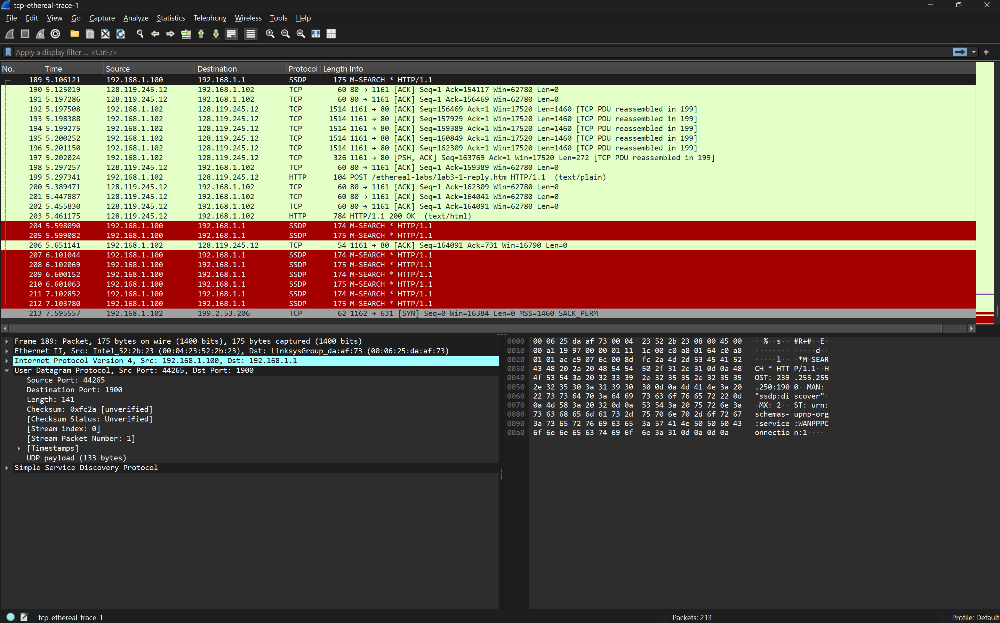
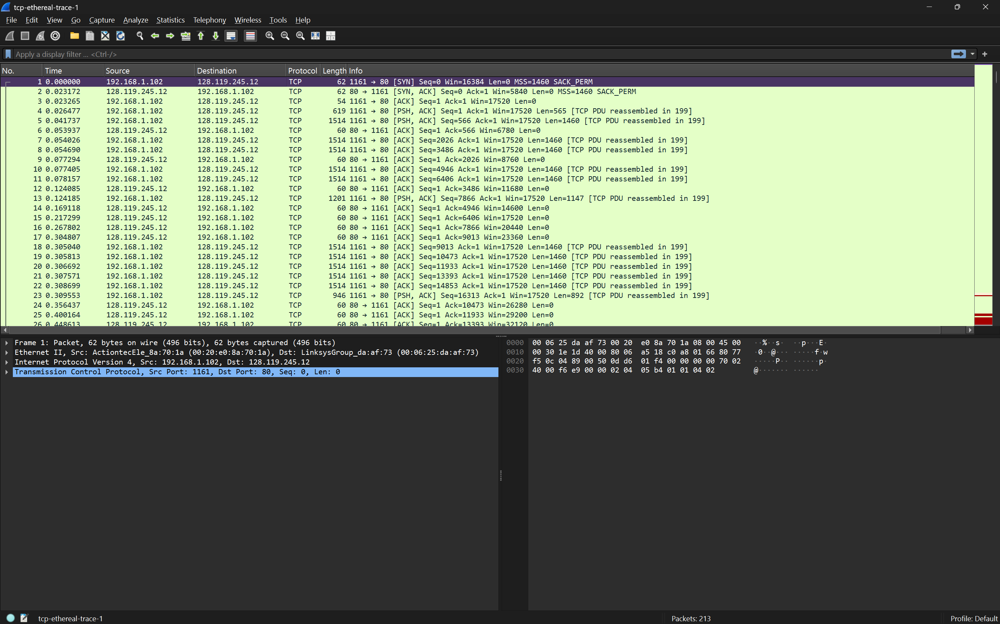

## Pertanyaan
1. Berapa alamat IP dan nomor port TCP yang digunakan oleh komputer klien (sumber) untuk mentransfer file ke gaia.cs.umass.edu? Cara paling mudah menjawab pertanyaan ini adalah dengan memilih sebuah pesan HTTP dan meneliti detail paket TCP yang digunakan untuk membawa pesan HTTP tersebut.
2. Apa alamat IP dari gaia.cs.umass.edu? Pada nomor port berapa ia mengirim dan menerima segmen TCP untuk koneksi ini? 
#### Jika Anda telah membuat trace Anda sendiri, jawab pertanyaan berikut:
3. Berapa alamat IP dan nomor port TCP yang digunakan oleh komputer klien Anda (sumber) untuk mentransfer ke gaia.cs.umass.edu?

## JAWABAN 

### soal 1
- Alamat IP Klien: 192.168.1.102
- Nomor Port TCP Klien: 1161

### soal 2
- Alamat IP Server: 128.119.245.12
- Nomor Port TCP Server: 80 (Port standar untuk layanan HTTP). Server menerima segmen di port 80 dan mengirimkan balasan dari port tersebut kembali ke klien.

### soal 3
- Alamat IP Klien Anda: 192.168.1.102
- Nomor Port TCP Klien Anda: 1161

