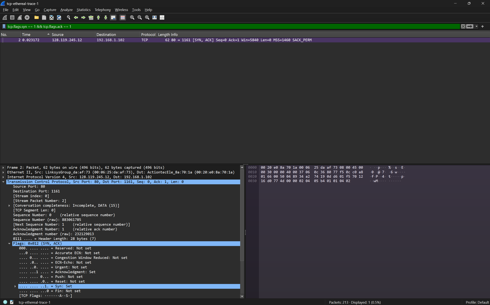
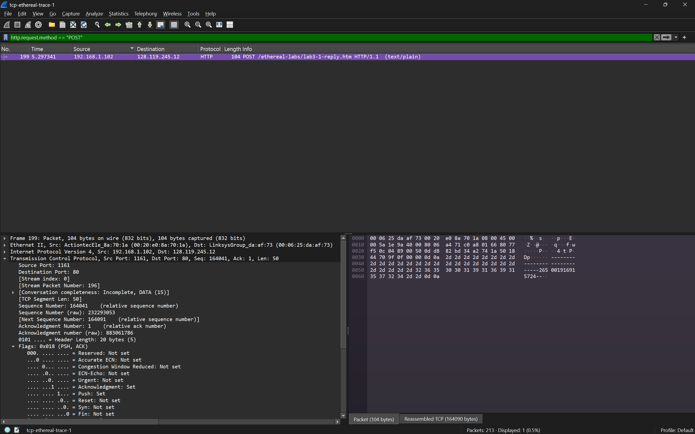
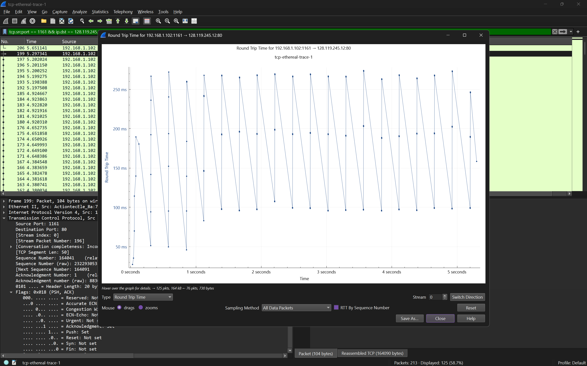
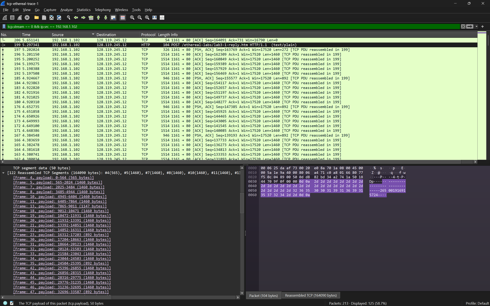
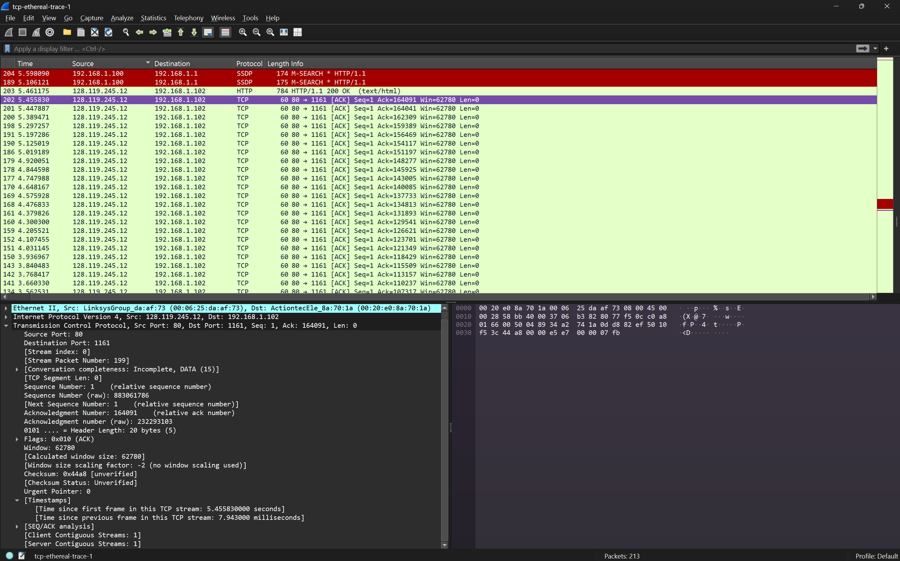
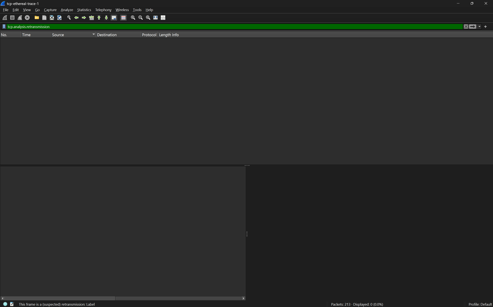
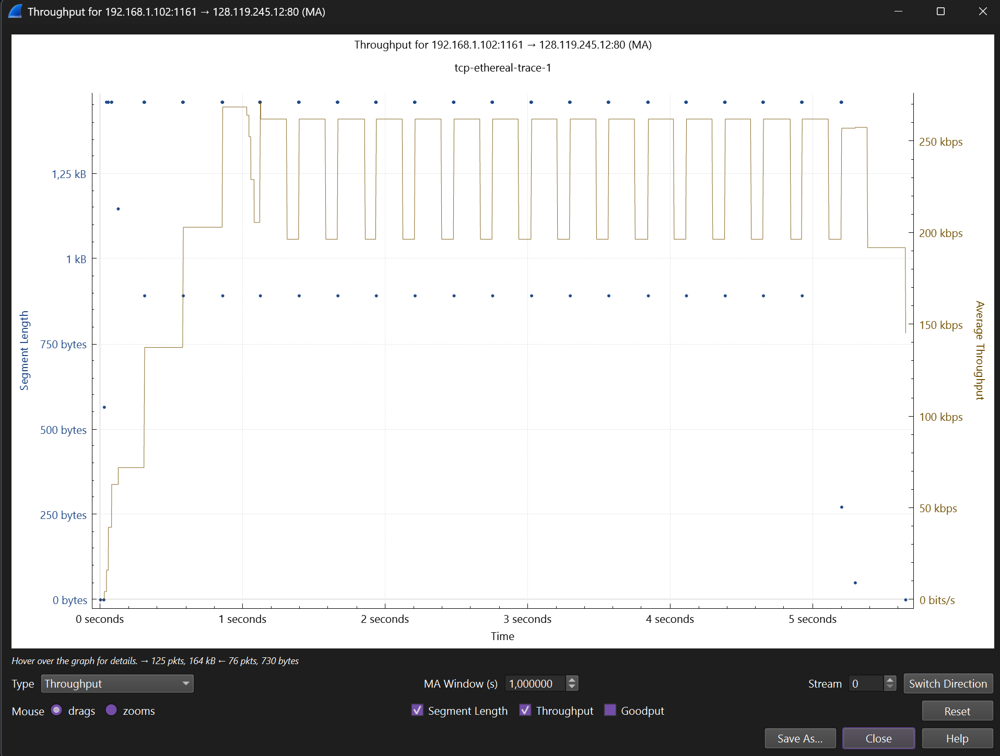

## Pertanyaan
1. Berapa nomor urut segmen TCP SYN yang digunakan untuk memulai sambungan TCP antara komputer klien dan gaia.cs.umass.edu? Apa yang dimiliki segmen tersebut sehingga teridentifikasi sebagai segmen SYN?
2. Berapa nomor urut segmen SYNACK yang dikirim oleh gaia.cs.umass.edu ke komputer klien sebagai balasan dari SYN? Berapa nilai dari field Acknowledgement pada segmen SYNACK? Bagaimana gaia.cs.umass.edu menentukan nilai tersebut? Apa yang dimiliki oleh segmen sehingga teridentifikasi sebagai segmen SYNACK?
3. Berapa nomor urut segmen TCP yang berisi perintah HTTP POST? Perhatikan bahwa untuk menemukan perintah POST, Anda harus menelusuri content field milik paket di bagian bawah jendela Wireshark, kemudian cari segmen yang berisi "POST" di bagian field DATAnya.
4. Anggap segmen TCP yang berisi HTTP POST sebagai segmen pertama dalam koneksi TCP.Berapa nomor urut dari enam segmen pertama dalam TCP (termasuk segmen yang berisi HTTP POST)? Pada jam berapa setiap segmen dikirim? Kapan ACK untuk setiap segmen diterima? Dengan adanya perbedaan antara kapan setiap segmen TCP dikirim dan kapan acknowledgement-nya diterima, berapakah nilai RTT untuk keenam segmen tersebut? Berapa nilai EstimatedRTT setelah penerimaan setiap ACK? (Catatan: Wireshark memiliki fitur yang memungkinkan Anda untuk memplot RTT untuk setiap segmen TCP yang dikirim.Pilih segmen TCP yang dikirim dari klien ke server gaia.cs.umass.edu pada jendela "daftar JARINGAN KOMPUTER 36 paket yang ditangkap". Kemudian pilih: Statistics->TCP Stream Graph- >Round Trip Time Graph).
5. Berapa panjang setiap enam segmen TCP pertama?
6. Berapa jumlah minimum ruang buffer tersedia yang disarankan kepada penerima dan diterima untuk seluruh trace? Apakah kurangnya ruang buffer penerima pernah menghambat pengiriman?
7. Apakah ada segmen yang ditransmisikan ulang dalam file trace? Apa yang anda periksa (didalam file trace) untuk menjawab pertanyaan ini?
8. Berapa banyak data yang biasanya diakui oleh penerima dalam ACK? Dapatkah anda mengidentifikasi kasus-kasus di mana penerima melakukan ACK untuk setiap segmen yang diterima?
9. Berapa throughput (byte yang ditransfer per satuan waktu) untuk sambungan TCP? Jelaskan bagaimana Anda menghitung nilai ini.
## JAWABAN 

### soal 1

- Segmen ini terdeteksi sebagai SYN karena pada bagian Flags di struktur header TCP, bit Syn bernilai 1 (Set), sementara bit Acknowledgment (ACK) bernilai 0. Ini adalah tanda bahwa klien ingin "sinkronisasi" atau membuka koneksi baru.

### soal 2

- Server (gaia.cs.umass.edu) mengambil Sequence Number dari SYN klien (0) lalu menambahnya dengan 1 ($0 + 1 = 1$). Ini adalah cara server mengatakan: "Saya sudah terima paket 0 kamu, sekarang kirimkan saya paket mulai dari nomor 1."

### soal 3

- Filter yang digunakan: `http.request.method == "POST"`
- Nomor urut (164041) segmen TCP yang berisi perintah HTTP POST adalah 1.

### soal 4

- 1. no paket = 192 , seq number = 156469 time = 5.197508 RTT = 0.099749
- 2. no paket = 193 , seq number = 157929 time = 5.198388 RTT = 0.091083
- 3. no paket = 194 , seq number = 159389 time = 5.199275 RTT = 0.098066
- 4. no paket = 195 , seq number = 160849 time = 5.200252 RTT = 0.097089
- 5. no paket = 196 , seq number = 162309 time = 5.201150 RTT = 0.096191
- 6. no paket = 199 , seq number = 164041 time = 5.297341 RTT = 0.092130

### soal 5

Rincian Panjang Segmen TCP 
- Segmen Pertama (Frame 4): panjang payload sebesar 565 bytes. 
- Segmen Kedua (Frame 5): panjang payload sebesar 1460 bytes. 
- Segmen Ketiga (Frame 7): panjang payload sebesar 1460 bytes. 
- Segmen Keempat (Frame 8): panjang payload sebesar 1460 bytes. 
- Segmen Kelima (Frame 10): panjang payload sebesar 1460 bytes. 
- Segmen Keenam (Frame 11): panjang payload sebesar 1460 bytes.

### soal 6

- Hambatan: Tidak, kurangnya ruang buffer tidak pernah menghambat pengiriman.
- Penjelasan: Hal ini terlihat dari nilai Win=62780 yang tetap stabil dan besar. Jika buffer menghambat, nilai ini akan mengecil hingga mendekati 0 (Zero Window), yang akan memaksa klien berhenti mengirim data untuk sementara.

### soal 7

Jawaban: Tidak ada segmen yang ditransmisikan ulang.

### soal 8

- Jumlah Data yang Diakui: Biasanya penerima mengakui 1460 byte data dalam satu ACK (setara dengan 1 MSS).

### soal 9

Cara Menghitung:$$\text{Throughput} = \frac{\text{Total Data Bytes}}{\text{Waktu Selesai} - \text{Waktu Mulai}}$$Langkah Perhitungan (Berdasarkan Gambar):Total Data: Ambil Sequence Number terakhir yang dikirim klien (Paket 199 memiliki Seq=164041 dan Len=50, jadi total data sampai paket itu adalah 164091 byte).Waktu Mulai: Paket No. 1 (SYN) pada jam 0.000000.Waktu Selesai: Paket ACK terakhir (No. 202) pada jam 5.455830.Estimasi Hasil:$$\text{Throughput} = \frac{164091 \text{ byte}}{5.455830 \text{ detik}} \approx 30.076 \text{ byte/detik}$$Penjelasan: Nilai ini adalah rata-rata kecepatan transfer data dari seluruh koneksi TCP tersebut.

